# mimiq-vqe

VQE for molecular ground state energies on QPerfect MIMIQ.

This is a port of my CUDA-Q VQE benchmark to MIMIQ, so the same molecules and
active spaces can be run on both and compared. The chemistry part (PySCF,
OpenFermion) is the same as in the CUDA-Q version. The circuits run on the
Exaqt state vector simulator.

## Status

- All 12 molecules x 9 active spaces (6 to 14 qubits, cc-pVDZ) have been run on
  an HPC cluster from the saved integral files: 108 of 108 active spaces reach
  the CASCI energy within chemical accuracy (1.6 mHa); the largest gap is
  0.375 mHa.
- The energies agree with the CUDA-Q runs of the same active spaces.
- Two UCCSD ansatze: spin-orbital (the default), which has the same excitations
  and the same number of parameters as CUDA-Q's UCCSD, and singlet. By default
  exp(T - T^dagger) is applied as one first-order Trotter step, as in CUDA-Q.
  (The sweep in `results/` used the singlet ansatz with one second-order step.)
- Closed shell molecules only.
- The results of the sweep are in [`results/`](results/README.md).

## Molecules

12 closed shell molecules, cc-pVDZ basis. Geometries are from NIST CCCBDB or
PubChem, as recorded in `config/molecules_data.py`.

**Hydrocarbons**

<table>
  <tr>
    <td align="center">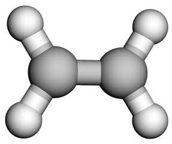 <b>Ethylene</b> C2H4</td>
    <td align="center">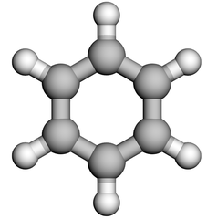 <b>Benzene</b> C6H6</td>
    <td align="center">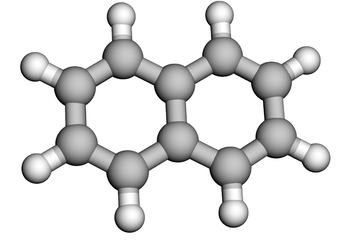 <b>Naphthalene</b> C10H8</td>
    <td align="center">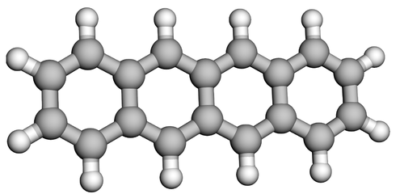 <b>Tetracene</b> C18H12</td>
    <td align="center">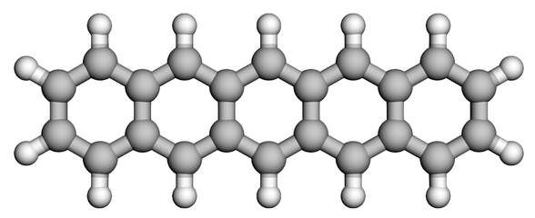 <b>Pentacene</b> C22H14</td>
  </tr>
</table>

**Nitrogen and amide systems**

<table>
  <tr>
    <td align="center">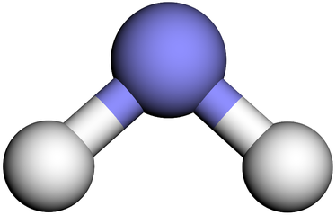 <b>Amide anion</b> NH2&minus;</td>
    <td align="center">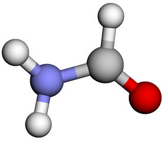 <b>Methanamide</b> CHONH2</td>
  </tr>
</table>

**Nucleobases**

<table>
  <tr>
    <td align="center">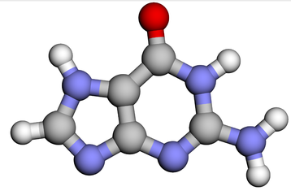 <b>Guanine</b> C5H5N5O</td>
    <td align="center">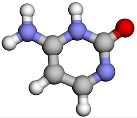 <b>Cytosine</b> C4H5N3O</td>
    <td align="center">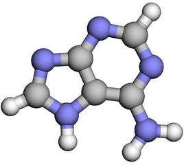 <b>Adenine</b> C5H5N5</td>
    <td align="center">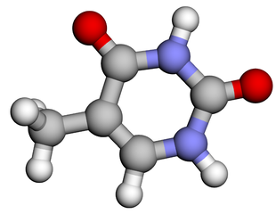 <b>Thymine</b> C5H6N2O2</td>
    <td align="center">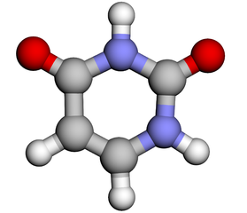 <b>Uracil</b> C4H4N2O2</td>
  </tr>
</table>

| Molecule | Formula | Electrons | Orbitals (cc-pVDZ) | Geometry |
|---|---|---:|---:|---|
| Ethylene | C2H4 | 16 | 48 | NIST CCCBDB |
| Benzene | C6H6 | 42 | 114 | NIST CCCBDB |
| Naphthalene | C10H8 | 68 | 180 | NIST CCCBDB |
| Tetracene | C18H12 | 120 | 312 | NIST CCCBDB |
| Pentacene | C22H14 | 146 | 378 | PubChem |
| Amide anion (NH2-) | NH2&minus; | 10 | 24 | NIST CCCBDB |
| Methanamide | CHONH2 | 24 | 57 | NIST CCCBDB |
| Guanine | C5H5N5O | 78 | 179 | PubChem |
| Cytosine | C4H5N3O | 58 | 137 | PubChem |
| Adenine | C5H5N5 | 70 | 165 | PubChem |
| Thymine | C5H6N2O2 | 66 | 156 | PubChem |
| Uracil | C4H4N2O2 | 58 | 132 | PubChem |

Each molecule has the same 9 active spaces, from 6 to 14 qubits, written as
(active electrons, active orbitals):

| Qubits | 6 | 8 | 10 | 12 | 14 |
|---|---|---|---|---|---|
| Active spaces | (2,3), (4,3) | (2,4), (4,4), (6,4) | (4,5), (6,5) | (6,6) | (6,7) |

The core orbitals below the active space are frozen. The number of core
orbitals for each space is `ncore` in `config/molecules_data.py`.

The data file also has NH3+ and Methylene. They are open shell and are not
run by this code.

## Requirements

Tested with:

    python             3.11
    mimiqcircuits      0.27.1
    exaqt              0.2.1
    mimiq-openfermion  0.1.0
    openfermion        1.8.1
    openfermionpyscf   0.5
    pyscf              2.14.0
    numpy              2.4
    scipy              1.17

exaqt and mimiq-openfermion are QPerfect packages and are not on PyPI.

For the GPU check (`tests/test_exaqt_gpu.py`) you need exaqt 0.3.0 with its
`gpu` extra and mimiqcircuits 0.28. Without a GPU those tests are skipped.

cudaq is optional. If it is installed it is only used to count the CUDA-Q
UCCSD parameters, so the optimizer settings match the CUDA-Q runs. Without it
a closed form count is used.

## Installation

    git clone https://github.com/ItsKhuramShahzad/mimiq-vqe.git
    cd mimiq-vqe

    conda create -n mimiq python=3.11
    conda activate mimiq

    pip install mimiqcircuits
    pip install openfermion openfermionpyscf pyscf numpy scipy pytest

Then install exaqt and mimiq-openfermion from QPerfect.

Check the install:

    python -c "import mimiqcircuits, exaqt, mimiq_openfermion, openfermion, pyscf; print('ok')"

## Running

Run everything from the repo root with `python -m`, because the code imports
`src.` and `config.`.

### One molecule

One active space of one molecule:

    python -m src.run_single --molecule Ethylene --space_idx 5

All 9 active spaces of a molecule:

    python -m src.run_single --molecule Ethylene

From the saved integral files (recommended; no SCF or CCSD inside the job):

    python -m src.run_single --molecule Ethylene --integrals integrals

`--space_idx` is the index into `valid_active_spaces` for that molecule in
`config/molecules_data.py`.

### Options

| Option | Default | What it does |
|---|---|---|
| `--molecule` | (required) | molecule name from `config/molecules_data.py` |
| `--space_idx` | all spaces | run only this active space |
| `--integrals` | none | read the Hamiltonian, CASCI energy and CCSD amplitudes from this folder |
| `--ansatz` | `spin` | `spin`: spin-orbital UCCSD with CUDA-Q's parameter count, or `singlet` UCCSD |
| `--trotter_order` | `1` | `1`: one first-order Trotter step, as in CUDA-Q; `2`: second-order Suzuki |
| `--target` | `exaqt-cpu` | `exaqt-cpu`: Exaqt state vector on the CPU; `exaqt-gpu`: on an NVIDIA GPU (cuStateVec) |
| `--basis` | `cc-pVDZ` | basis set |
| `--optimizer` | `COBYLA` | SciPy optimizer |
| `--out_dir` | `pkl_results/mimiq_exaqt_uccsd_<ansatz>` | where the result pkl is written |
| `--max-memory` | `16000` | PySCF memory limit in MB, when a missing integral file has to be made |

### Singlet or spin-orbital UCCSD

    python -m src.run_single --molecule Ethylene --integrals integrals --ansatz singlet
    python -m src.run_single --molecule Ethylene --integrals integrals --ansatz spin

| Active space | Qubits | Singlet | Spin-orbital (= CUDA-Q) |
|---|---|---:|---:|
| (2,3) | 6 | 5 | 8 |
| (4,4) | 8 | 14 | 26 |
| (6,5) | 10 | 27 | 54 |
| (6,6) | 12 | 54 | 117 |
| (6,7) | 14 | 90 | 204 |

Both start from the CCSD amplitudes and give the same starting energy. The
spin-orbital ansatz lists its excitations in the same order as CUDA-Q, so
parameter k means the same excitation on both.

### Trotter order

    python -m src.run_single --molecule Ethylene --integrals integrals --trotter_order 1
    python -m src.run_single --molecule Ethylene --integrals integrals --trotter_order 2

exp(T - T^dagger) is applied as Pauli rotations. First order (`push_lietrotter`)
applies each rotation once, like the CUDA-Q kernel; second order
(`push_suzukitrotter`) goes forward with half angles and back, so the circuit is
twice as long. On small spaces both reach the CASCI energy with about the same
number of evaluations, and first order is about twice as fast per evaluation.

### Output

One pkl file per molecule, for example

    pkl_results/mimiq_exaqt_uccsd_singlet/01_OCT_2026_Ethylene_cc-pVDZ_exaqt-cpu_COBYLA_uccsd_singlet_VQE_results.pkl
    pkl_results/mimiq_exaqt_uccsd_spin/01_OCT_2026_Ethylene_cc-pVDZ_exaqt-cpu_COBYLA_uccsd_spin_VQE_results.pkl

`exaqt-cpu` says where it ran, like `qpp-cpu` or `nvidia` in the CUDA-Q file
names. The layout of the pkl is the same as in the CUDA-Q version, so the same
analysis scripts can read both. Keep the two ansatze in separate folders: the
analysis reads every pkl in a folder.

For each active space it prints the energy of the starting point and the final
VQE energy next to CASCI:

    [RUN] Ethylene | BASIS=cc-pVDZ | TARGET=exaqt-cpu | OPT=COBYLA | ANSATZ=spin
    [SPACE] Ethylene ncore=6 nele=4 norb=4 -> 8 qubits
    [SEED ] CCSD-sliced (singlet packer, from integral file), mapped to spin orbital excitations: E_theta0=-78.0564953257 recovers  94.6% of active correlation ...
    [SPACE] done E_VQE=-78.0575249461 E_CASCI=-78.0575249469 diff=+7.73e-10 cycles=3 t=288.4s

### Integral files

With `--integrals <folder>`, files are read from
`<folder>/<basis>/<molecule>/space_*_ncore_C_nele_E_norb_O.npz` (see
`integrals/README.md`). If a file is missing, or has no CCSD amplitudes, it is
computed (integrals and amplitudes), saved there, and used; later runs read it.

To make all the files in advance:

    python scripts/dump_active_integrals.py --ccsd

Every VQE starts from the CCSD amplitudes. If CCSD does not converge, the run stops.

### Final runs (as the CUDA-Q final run)

`scripts/run_cpu_final.sh` and `scripts/run_gpu_final.sh` (with `scripts/final_run_common.sh`)
run one array task per molecule, its 9 active spaces one after another on one core, with the
spin ansatz and one first-order Trotter step, from `integrals/`. They stop if the software
versions differ from the shared environment or if `src/` has uncommitted changes. Give the
account and partition on the command line:

    mkdir -p logs
    sbatch -A <account> -p <partition> scripts/run_cpu_final.sh                          # exaqt-cpu
    sbatch -A <account> --qos=<qos> -p <gpu partition> scripts/run_gpu_final.sh          # exaqt-gpu
    SPACE_IDX=7 sbatch -A <account> -p <partition> --array=0 scripts/run_cpu_final.sh    # short test

Each PKL records the machine and code in `run_metadata` (hostname, CPU model, GPU, SLURM job,
thread settings, git commit) and the timing split: `simulated_quantum_runtime` (Exaqt's own
`timings['total']`), `circuit_build_runtime`, `optimizer_runtime`, `seed_search_runtime`, and
per evaluation `quantum_times`, `evaluation_times` and `exaqt_timings`.

### On an HPC cluster (the earlier sweep)

The 14 qubit spaces take hours, so the sweep in `results/` was run with SLURM,
one job per molecule and its 9 active spaces side by side:

    #SBATCH --array=0-11
    #SBATCH --cpus-per-task=18
    #SBATCH --mem=48G

    MOLS=(NH2- Ethylene Methanamide Benzene Uracil Cytosine Thymine Adenine Guanine Naphthalene Tetracene Pentacene)
    MOL=${MOLS[$SLURM_ARRAY_TASK_ID]}
    export OMP_NUM_THREADS=2

    for SPACE in 0 1 2 3 4 5 6 7 8; do
        python -m src.run_single --molecule "$MOL" --space_idx $SPACE --ansatz singlet \
            --integrals integrals --out_dir pkl_results/mimiq_exaqt_uccsd_singlet/spaces/$MOL/space_idx_$SPACE &
    done
    wait

Add your own account, partition and time limit. Exaqt takes its threads from
`RAYON_NUM_THREADS`, not `OMP_NUM_THREADS`; set `RAYON_NUM_THREADS=1` for one core
per space. Then put the 9 spaces of each molecule back into one pkl:

    python scripts/merge_space_pkls.py --in pkl_results/mimiq_exaqt_uccsd_singlet/spaces \
                                       --out pkl_results/mimiq_exaqt_uccsd_singlet

## How it works

For each molecule:

1. SCF (RHF) and CCSD with PySCF on the full molecule (cc-pVDZ unless `--basis`
   says otherwise). CCSD must converge, otherwise the run stops.

Then for each active space:

2. CASCI with PySCF, used as the reference energy.
3. Active space Hamiltonian from OpenFermion, Jordan-Wigner mapping.

With `--integrals`, steps 1 to 3 come from the saved file instead: the CASCI
energy is read, the Hamiltonian is built from the stored integrals
(`qubit_hamiltonian` in `src/integrals.py`), and the CCSD amplitudes for step 5
are the ones stored for that active space.

4. Convert the OpenFermion QubitOperator to a MIMIQ Hamiltonian. The identity
   term is taken out as a constant. (`src/mimiq_hamiltonian.py`)
5. Starting parameters: the CCSD amplitudes are cut to the active space and
   put in the order that OpenFermion's `uccsd_singlet_generator` expects
   (`slice_ccsd_to_active` and `pack_ccsd_singlet` in `src/run_single.py`).
   For the spin-orbital ansatz they are then mapped onto its excitations, giving
   the same operator (`singlet_to_spin_params` in `src/mimiq_ansatz.py`).
6. Energy function: build the UCCSD circuit for the parameters, Hartree-Fock
   state followed by exp(T - T^dagger) as one Trotter step (first order by
   default, `push_trotter` in `src/mimiq_ansatz.py`), add
   `push_expval` for the Hamiltonian, run on Exaqt, read `zstates[0][0]`.
   (`src/mimiq_backend.py`, `src/mimiq_ansatz.py`)
7. Optimisation with COBYLA: a seed search from the CCSD point and a few
   jittered copies of it, then repeated optimisation cycles until the energy
   stops improving. (`src/mimiq_driver.py`)
8. Check the result (`src/schema.py`) and save the pkl.

The optimizer settings are the same as in the CUDA-Q script: COBYLA, tol 1e-10,
rhobeg 0.2, 3 restarts, cycles of 600 iterations, stop after 3 cycles that
improve by less than 1e-6 Ha. Heavy mode (more than 150 parameters) is decided
from the CUDA-Q parameter count, so both backends use the same settings for the
same active space.

## Tests

    python -m pytest tests/ -q

- `test_ansatz.py`: H2. Zero parameters give the Hartree-Fock energy, the CCSD
  start is below Hartree-Fock and recovers most of the correlation, VQE
  converges to FCI.
- `test_ansatz_spin.py`: the spin-orbital ansatz has CUDA-Q's parameter count
  for 6 to 14 qubits, keeps every electron's spin, gives Hartree-Fock at zero
  parameters, and starts from the same energy as the singlet ansatz.
- `test_driver.py`: the full optimisation loop on H2 from the CCSD start, and
  the ansatz builder with sparse parameters.
- `test_theta0.py`: the CCSD packing gives back the same cluster operator, and
  the CCSD start is below Hartree-Fock on LiH.
- `test_integrals.py`: Ethylene sto-3g. A saved file gives the same Hamiltonian
  and CCSD start as the geometry route, VQE from the file alone reaches CASCI,
  bad files are refused, and missing files or amplitudes are made, saved and
  reused. It runs several VQEs, so it takes a few minutes.
- `test_exaqt_gpu.py`: the Exaqt GPU backend gives the same energies as the CPU
  one on Ethylene (6 and 14 qubits). Skipped where there is no GPU.

`tests/test_hamiltonian_bridge.py` compares the spectrum of the MIMIQ
Hamiltonian with OpenFermion. It has a LiH case that takes a long time.

GPU against CPU, energies and time per energy:

    python scripts/test_exaqt_gpu.py

## Files

    config/molecules_data.py     molecules, geometries, active spaces
    src/run_single.py            command line entry point, one molecule
    src/mimiq_hamiltonian.py     OpenFermion QubitOperator to MIMIQ Hamiltonian
    src/mimiq_ansatz.py          UCCSD circuits: singlet and spin-orbital
    src/mimiq_backend.py         energy function on Exaqt
    src/mimiq_driver.py          COBYLA optimisation loop
    src/schema.py                checks the result before saving
    src/utils.py                 file names, pkl save, stable hash for seeding
    src/integrals.py             active space integrals and CCSD amplitudes: make, save, load
    scripts/dump_active_integrals.py   make the integral files for all molecules
    scripts/merge_space_pkls.py        one pkl per molecule from per-space runs
    scripts/test_exaqt_gpu.py          Exaqt GPU against CPU: energies and timing
    scripts/run_cpu_final.sh           final run, CPU (with final_run_common.sh)
    scripts/run_gpu_final.sh           final run, GPU (with final_run_common.sh)
    integrals/                   saved integral files (see integrals/README.md)
    images/molecules/           molecule pictures used above
    results/                    VQE results of the sweep, one pkl per molecule (see results/README.md)
    tests/                       tests
    env/                         conda environment files

## Author

Khuram Shahzad
